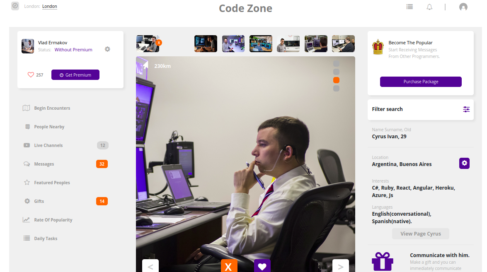

# html-css-capstone

# HTML and CSS Capstone Microverse Project

The project is based on social network to find acquittances. Its a platform on which programmers share the technologies that they use in their work and the projects they are engaged in.

# Code Zone
Design idea by Vlad Ermakov on Dribbble

Project: Building with Responsive Design

## Built With

- HTML5,
- CSS3

## Live Demo

[Live Demo Link](https://raw.githack.com/kwizl/html-css-capstone/development/index.html)
[Video Demo Link](https://www.loom.com/share/7ea0de1d80c0422686102d12927d4797)

## Getting Started

**Use browser of choice**

## Authors

👤 **Martin Njoroge**

- Github: [@kwizl](https://github.com/kwizl)
- Twitter: [@NjoroKaris](https://twitter.com/NjoroKaris)
- Linkedin: [martin njoroge](https://www.linkedin.com/in/martin-njoroge-098774110/)

## 🤝 Contributing

Contributions, issues and feature requests are welcome!

## Show your support

Give a ⭐️ if you like this project!
